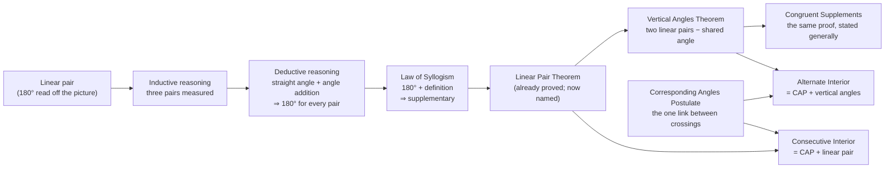

# The story: how the concepts build on each other

The Concepts page no longer follows the reference's sections. The sections are a filing system — reasoning in §2, properties in §4, points in §5, segments in §6 — and read in that order most ideas turn up before anything has made them necessary. The same concepts are now told as a ladder: eight chapters, each rung supplying exactly what the next needs.

The data is in [`src/practice/content/story.ts`](../src/practice/content/story.ts). A test ([`tests/story.test.ts`](../tests/story.test.ts)) checks that every concept is told exactly once, in its own module, and never before the concepts it stands on.

## The idea underneath

A figure shows **where** things sit: on a line, beside each other, across a crossing. Every theorem in both modules turns that into a fact about **how big** they are.

| A fact about position (seen or marked) | becomes a fact about size (calculated) | by |
|---|---|---|
| B is between A and C | AB + BC = AC | Segment Addition Postulate |
| two angles form a linear pair | they total 180° | Linear Pair Theorem |
| two angles are vertical | they are congruent | Vertical Angles Theorem |
| two angles are corresponding, *and m ∥ n* | they are congruent | Corresponding Angles Postulate |
| two angles are alternate interior, *and m ∥ n* | they are congruent | Alternate Interior Angles Theorem |
| two angles are consecutive interior, *and m ∥ n* | they total 180° | Consecutive Interior Angles Theorem |

Proof is the machine that does the turning, and the properties of equality are its gears. Chapters 1–3 build the objects, Chapter 4 the gears, Chapter 5 the machine, and Chapters 6–8 run it.

Three threads run through the whole story, and the bridges name them when they come back:

- **Only what is marked counts.** Ticks, then arcs, then squares, then arrowheads. The same rule turns into the gap between induction and deduction: a figure can suggest a rule but can't establish one.
- **The same idea twice.** Angles repeat the segment story (size, parts adding to a whole, halving). Complements repeat supplements. The exterior pairs repeat the interior pairs.
- **The hypothesis does the work.** Segment addition needs *between*, angle addition needs *interior*, and the Corresponding Angles Postulate needs *parallel*. Each walkthrough shows what breaks when that condition is taken away.

## The chapters

| # | Chapter | The question it exists to answer |
|---|---|---|
| 1 | Measuring a segment | A figure is a drawing. How does it become something you can calculate with? |
| 2 | Angles: the same story again | Everything a segment could do — have a size, add up, be halved — can an angle do too? |
| 3 | Where angles sit, and what that makes them | When two angles share a vertex, what does their position alone tell you about their size? |
| 4 | The rules for moving an equation | Once a figure has handed you some equations, what are you allowed to do with them? |
| 5 | How do we know? | Every linear pair you have ever measured totals 180°. Is that enough to be sure? |
| 6 | From where they sit to how big they are | Which facts about position can proof turn into facts about measure? |
| 7 | One line across two *(Module 3)* | At one crossing you already know everything. What can be said about an angle at one crossing and an angle at another? |
| 8 | What parallel lines buy *(Module 3)* | What does it take to carry an angle from one crossing to the other — and once you can, what follows? |

Each chapter opens with its question. Each concept opens with a **bridge**: why this idea, and why now, told from what came before. Each chapter ends with a **close**: what can now be done, and what still can't, which is the question the next chapter takes up. Each concept also lists what it **builds on**, and what it is **the same idea as**. Both are links, and a Module 3 concept can link back into Module 2 and return.

### The ladder at its steepest

The spine of the story is one long chain. In the old order it was broken up across four sections.

The walkthroughs were rewritten so that the chain is real and not just claimed:

- **Deductive reasoning** used to prove its example by citing the Vertical Angles Theorem, three chapters before that theorem is proved. It now proves the exact conjecture that *Inductive reasoning* ends on: every linear pair totals 180°. The proof uses the definition of a straight angle, the Angle Addition Postulate and substitution, and measures nothing.
- **Law of Syllogism** used the same forward reference. It now chains that proved 180° with the definition of supplementary, and what comes out is the Linear Pair Theorem, word for word.
- **Linear Pair Theorem** now opens by saying it has already been proved, and that it gets a name because every later theorem uses it.
- **Linear pair** says its "= 180" is read off the picture for now, and that it will be proved later.

## What is borrowed from Terence Tao

As far as I could find, Tao hasn't published a school geometry sequence, so none of this reproduces a course of his. What it applies is the teaching he describes in his own writing.

**The ladder.** His public lecture *The Cosmic Distance Ladder* is built so that each rung supplies what the next rung measures with. That is the structure here: the bridges exist to say what the previous rung couldn't reach, and the chapter closes say what is still missing. ([lecture](https://terrytao.wordpress.com/2010/10/10/the-cosmic-distance-ladder-ver-4-1/), [the book](https://terrytao.wordpress.com/books/climbing-the-cosmic-distance-ladder/), [with 3Blue1Brown](https://www.3blue1brown.com/lessons/cosmic-distance-1/))

**Pre-rigorous, rigorous, post-rigorous.** Tao describes mathematical learning in three stages: intuition from examples; then formal proof; then intuition again, now backed by the proof. He also writes that rigour is there to destroy bad intuition while clarifying good intuition, not to replace intuition. ([There's more to mathematics than rigour and proofs](https://terrytao.wordpress.com/career-advice/theres-more-to-mathematics-than-rigour-and-proofs/)) The story moves through those stages on purpose:

1. Chapter 3 uses "= 180" and "vertical angles are equal" because the pictures show it. That is the pre-rigorous stage, and the text admits it.
2. Chapters 5 and 6 earn both claims. That is the rigorous stage.
3. Chapter 8 ends on a post-rigorous view: every angle in the figure equals ∠1 or makes 180° with it, readable at a glance.

The nearly-parallel figure and the tick marks that go missing in the inductive walkthrough are examples of rigour destroying bad intuition.

**Ask yourself dumb questions.** Tao recommends asking what happens if a hypothesis is removed, where a proof uses each hypothesis, and what the degenerate cases are. ([Ask yourself dumb questions – and answer them!](https://terrytao.wordpress.com/career-advice/ask-yourself-dumb-questions-and-answer-them/)) Three walkthrough steps were added to ask them:

- *Alternate Interior Angles Theorem*: "Where did the proof use m ∥ n?" Only in its first step. Then the same pair is shown on lines that aren't parallel.
- *Consecutive Interior Angles Theorem*: the degenerate case, a perpendicular transversal, where every pair is congruent and supplementary at once. It has its own figure.
- *Corresponding Angles Postulate*: why this rule is the one accepted without proof, when any of the five could be. This is Tao's question of whether method X can be replaced by method Y. It is also the reference's Turn and Talk.

Removing the hypothesis was already in place in several walkthroughs: B outside AC for segment addition, lines that aren't parallel for the postulate, a point equidistant from A and B but off the segment for the midpoint.

**Recognise an old problem.** Tao's problem-solving advice is to look for an earlier problem with the same structure, and to find the objective before the method. ([Solving Mathematical Problems](https://terrytao.wordpress.com/books/solving-mathematical-problems/)) That is where the "The same idea as" links come from, and why Chapter 2's title calls it the same story again. It is also why each Module 3 theorem is presented as the postulate plus one Module 2 theorem, rather than as something new. The *Proof* walkthrough already reads the given and the goal before writing any lines.

**Dependencies as a graph.** In Tao's Lean formalisation projects, the proof is organised as a "blueprint": a graph of which results rest on which. ([blueprint posts](https://terrytao.wordpress.com/tag/blueprint/)) `NEEDS` in `story.ts` is that graph for this curriculum, and the test is what keeps the story honest about it.

## Every dependency

An arrow means the later concept's explanation uses the earlier one. The graph is generated from `NEEDS`; `ECHOES` (same idea, different clothing) is kept separately and is not drawn here.

```mermaid
flowchart TB
  subgraph ch1["1 · Measuring a segment"]
    point_and_line["Point and line"]
    collinear["Collinear"]
    segment_addition["Segment Addition Postulate"]
    congruent_segments["Congruent segments"]
    midpoint["Midpoint"]
    segment_bisector["Segment bisector"]
  end
  subgraph ch2["2 · Angles: the same story again"]
    right["Right angle"]
    acute["Acute angle"]
    obtuse["Obtuse angle"]
    straight["Straight angle"]
    congruent_angles["Congruent angles"]
    angle_addition["Angle Addition Postulate"]
    angle_bisector["Angle bisector"]
  end
  subgraph ch3["3 · Where angles sit, and what that makes them"]
    adjacent["Adjacent angles"]
    linear_pair["Linear pair"]
    vertical_angles["Vertical angles"]
    supplementary["Supplementary angles"]
    complementary["Complementary angles"]
    perpendicular["Perpendicular"]
    perpendicular_bisector["Perpendicular bisector"]
    angles_around_point["Angles around a point"]
  end
  subgraph ch4["4 · The rules for moving an equation"]
    reflexive["Reflexive Property"]
    symmetric["Symmetric Property"]
    transitive["Transitive Property"]
    substitution["Substitution Property"]
    addition_property["Addition Property of Equality"]
    subtraction_property["Subtraction Property of Equality"]
    multiplication_property["Multiplication Property of Equality"]
    division_property["Division Property of Equality"]
    distributive["Distributive Property"]
  end
  subgraph ch5["5 · How do we know?"]
    inductive["Inductive reasoning"]
    deductive["Deductive reasoning"]
    syllogism["Law of Syllogism"]
    proof["Proof"]
  end
  subgraph ch6["6 · From where they sit to how big they are"]
    linear_pair_theorem["Linear Pair Theorem"]
    vertical_angles_theorem["Vertical Angles Theorem"]
    congruent_supplements["Congruent Supplements Theorem"]
    congruent_complements["Congruent Complements Theorem"]
    right_angle_congruence["Right Angle Congruence Theorem"]
  end
  subgraph ch7["7 · One line across two"]
    transversal["Transversal"]
    corresponding_angles["Corresponding angles"]
    alternate_interior["Alternate interior angles"]
    consecutive_interior["Consecutive interior angles"]
    alternate_exterior["Alternate exterior angles"]
    consecutive_exterior["Consecutive exterior angles"]
  end
  subgraph ch8["8 · What parallel lines buy"]
    parallel_lines["Parallel lines"]
    corresponding_angles_postulate["Corresponding Angles Postulate"]
    alt_interior_theorem["Alternate Interior Angles Theorem"]
    flow_proof["Flow proof"]
    alt_exterior_theorem["Alternate Exterior Angles Theorem"]
    cons_interior_theorem["Consecutive Interior Angles Theorem"]
    cons_exterior_theorem["Consecutive Exterior Angles Theorem"]
  end
  point_and_line --> collinear
  collinear --> segment_addition
  point_and_line --> congruent_segments
  segment_addition --> midpoint
  congruent_segments --> midpoint
  midpoint --> segment_bisector
  point_and_line --> right
  right --> acute
  right --> obtuse
  obtuse --> straight
  collinear --> straight
  right --> congruent_angles
  right --> angle_addition
  angle_addition --> angle_bisector
  congruent_angles --> angle_bisector
  angle_addition --> adjacent
  adjacent --> linear_pair
  straight --> linear_pair
  linear_pair --> vertical_angles
  linear_pair --> supplementary
  supplementary --> complementary
  right --> complementary
  right --> perpendicular
  linear_pair --> perpendicular
  segment_bisector --> perpendicular_bisector
  perpendicular --> perpendicular_bisector
  angle_addition --> angles_around_point
  straight --> angles_around_point
  angle_addition --> reflexive
  congruent_segments --> symmetric
  congruent_segments --> transitive
  transitive --> substitution
  segment_addition --> substitution
  reflexive --> addition_property
  congruent_angles --> addition_property
  angle_addition --> addition_property
  addition_property --> subtraction_property
  linear_pair --> subtraction_property
  midpoint --> multiplication_property
  multiplication_property --> division_property
  angle_bisector --> division_property
  multiplication_property --> distributive
  segment_addition --> distributive
  linear_pair --> inductive
  congruent_segments --> inductive
  inductive --> deductive
  angle_addition --> deductive
  straight --> deductive
  substitution --> deductive
  deductive --> syllogism
  supplementary --> syllogism
  transitive --> syllogism
  syllogism --> proof
  reflexive --> proof
  addition_property --> proof
  substitution --> proof
  congruent_angles --> proof
  syllogism --> linear_pair_theorem
  supplementary --> linear_pair_theorem
  linear_pair_theorem --> vertical_angles_theorem
  vertical_angles --> vertical_angles_theorem
  substitution --> vertical_angles_theorem
  subtraction_property --> vertical_angles_theorem
  proof --> vertical_angles_theorem
  vertical_angles_theorem --> congruent_supplements
  supplementary --> congruent_supplements
  congruent_supplements --> congruent_complements
  complementary --> congruent_complements
  right --> right_angle_congruence
  transitive --> right_angle_congruence
  point_and_line --> transversal
  vertical_angles --> transversal
  linear_pair --> transversal
  transversal --> corresponding_angles
  transversal --> alternate_interior
  linear_pair --> alternate_interior
  transversal --> consecutive_interior
  transversal --> alternate_exterior
  transversal --> consecutive_exterior
  point_and_line --> parallel_lines
  congruent_segments --> parallel_lines
  parallel_lines --> corresponding_angles_postulate
  corresponding_angles --> corresponding_angles_postulate
  congruent_angles --> corresponding_angles_postulate
  corresponding_angles_postulate --> alt_interior_theorem
  alternate_interior --> alt_interior_theorem
  vertical_angles_theorem --> alt_interior_theorem
  transitive --> alt_interior_theorem
  proof --> flow_proof
  alt_interior_theorem --> flow_proof
  corresponding_angles_postulate --> alt_exterior_theorem
  alternate_exterior --> alt_exterior_theorem
  vertical_angles_theorem --> alt_exterior_theorem
  transitive --> alt_exterior_theorem
  corresponding_angles_postulate --> cons_interior_theorem
  consecutive_interior --> cons_interior_theorem
  linear_pair_theorem --> cons_interior_theorem
  substitution --> cons_interior_theorem
  supplementary --> cons_interior_theorem
  corresponding_angles_postulate --> cons_exterior_theorem
  consecutive_exterior --> cons_exterior_theorem
  linear_pair_theorem --> cons_exterior_theorem
  substitution --> cons_exterior_theorem
  supplementary --> cons_exterior_theorem
```

The full graph (52 concepts)

## Decisions worth revisiting

- **Reasoning comes after the objects, not first.** The reference opens with §2 and §3. Here inductive and deductive reasoning arrive in Chapter 5, once there are claims worth doubting. That is when "is that enough to be sure?" has something to be about.
- **The properties of equality come before reasoning.** Deduction uses substitution, so the gears have to exist before the machine does.
- **The perpendicular bisector moved to Chapter 3.** It needs *perpendicular*, and it lands there as a callback to Chapter 1's bisector.
- **Chapter numbering runs across both modules.** Module 3 opens at Chapter 7. That is deliberate: it says Module 3 continues the story rather than starting a new one.
- **The Definitions flip deck is dealt in story order** on its first pass. The Practice quizzes stay shuffled, because retrieval practice benefits from mixing.
