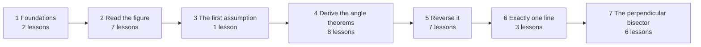

# Plan: a Duolingo-style path for Module 3

## Status

**All seven units are playable**: 36 lessons, three of them optional "Prove it" lessons, and six checkpoints. The path is the home page. Concepts, Practice and Cards live under a Library menu. The six decisions below were settled on the recommended side:

1. The Pythagorean Theorem and reflection are taught at 7.1, where they are first used.
2. Unit 3 is one lesson, with no checkpoint; Unit 4's checkpoint covers it.
3. Lessons are locked until the one before is done, and a unit's banner offers "Test out to here" (a 12-question checkpoint over the skipped units, 80% to pass).
4. Streak and XP, no hearts.
5. The old pages are in the Library.
6. The full proof builder is used only in the optional "Prove it" lessons (4.8, 5.8, 6.4). They never lock the path, and their proofs are not drawn for review. Checkpoints were also meant to include a proof. They don't: one full proof in a 12-question check is too heavy on a phone. Checkpoints use flow proofs and one-step proofs instead.

Built so far, in `src/practice/path/`:

- `questions.ts`: the question shapes, plus the Unit 1–2 makers.
  - Shapes: choice (optionally with a proof's lines above it, for "which reason?"), number, tap an angle, tap a line, put steps in order, flow proof / reason table, and a whole proof.
  - Makers: small generators, each tagged with the concepts it uses.
- `makers.ts`: the Unit 3–7 makers.
  - Relate, find the angle and which rule, each for the pair kinds taught so far.
  - Tap every congruent or supplementary angle, and angle algebra drawn at the answer.
  - Generated flow proofs, with a replayable two-column proof behind each.
  - Which test / enough / find x for parallel lines, and "which is the converse?" and "is the converse true?".
  - Forwards or backwards, how many lines through P, and the construction steps (order them, or say which comes next).
  - Pythagorean lengths, reflection, "is P equidistant?", the perpendicular bisector lengths and cases.
- `path.ts`: units → lessons, giving the concepts each lesson teaches and its guided and core makers.
  - A lesson may set its own size, e.g. 4.2 has 1 guided, 3 core and 1 review.
  - A lesson may be marked optional.
- `session.ts`: how a run of questions is made.
  - A lesson asks each kind of exercise (a maker's `family`) once, the guided form first, then two review questions from earlier lessons on the concepts most in need. Drilling is left to review and endless practice.
  - A checkpoint asks each of its units' exercises once, up to twelve.
  - Endless practice picks the next exercise weighted toward the weakest and most overdue of the chosen concepts. It never repeats the last exercise, avoids the same kind twice running, and brings a miss back three questions later.
- `Endless.tsx`: choose the concepts (by unit, "due for review", or everything learned), then practise until you stop. Every answer is saved as it comes in.
- Any answered question in a lesson, checkpoint or practice run can be gone back to with ‹ ›, and the end screen lists every answer as a link back to its question.
- `progress.ts`: done lessons, passed units, XP, streak and a strength and review date per concept, kept in the browser (`geometry-path-m3-v1`). A missed concept is due again the same day; review gaps then run 1, 3, 7 and 14 days.
- `PathPage.tsx`, `LessonPlayer.tsx`, `QuestionView.tsx`.

`tests/path.test.ts` checks these things:

- every Module 3 concept is taught exactly once, in the story's order;
- no question asks about a concept before its lesson;
- every question from every lesson is well formed across 25 seeds; every whole proof replays through the checker, and every flow blank's answer is among the reasons offered;
- every generated flow proof replays as a two-column proof;
- optional lessons never lock the next lesson or the checkpoint;
- a lesson never repeats a kind of exercise, and reviews after the first lesson;
- checkpoints are distinct exercises, twelve at most, with no whole proof;
- endless practice asks only about learned concepts, never repeats the last exercise, and brings a miss back.

Next, if wanted:
- replay levels (harder variants on a second pass);
- a module review after Unit 7;
- review scheduled by due date across sessions, not only inside lessons.

## Why a path

Today the app has one page per kind of thing. The Concepts page explains, Practice has seven exercise tabs, and Cards drills. A student has to decide what to do next, and nothing stops them opening "Parallel tests" before they can name an angle pair. The path makes that decision for them:

- **One new idea per node**, taught right before it is practised: Tao's ladder, one rung at a time.
- **Recognise before produce before prove.** A node's first questions give two or three options with the angles highlighted. Later questions give all the options with no highlight. Only after that does a proof appear.
- **Interleave.** About 70% of a lesson is the new idea and 30% is review of earlier ones, weakest first.
- **Mistakes come back.** A missed question returns as a fresh version before the lesson ends, and the lesson finishes only once it is answered.
- **Check at the end of each unit**, and review on a schedule after that.
- **Plant the confusions on purpose, at the moment they become possible.** Four matter in this module:
  - congruent versus supplementary;
  - marked versus merely looking parallel;
  - forward theorem versus its converse;
  - a bisector versus a perpendicular bisector.

## Shape

- **Seven units**, one per stage, each opening on the question its chapter already has.
- **34 lessons and 6 checkpoints**, counting the closing module review. A lesson takes about five minutes and 8–10 questions.
- **Circles on a winding path** in each unit. Each circle is locked, current or done; a checkpoint ends each unit.

## The path, lesson by lesson

Legend for the right-hand column: *have* is an existing generator or item; **new** is an item type to build. The reuse inventory below maps these to files.

### Unit 1 · Foundations — "What does this module lean on?"

| # | Lesson | Introduces | Questions |
|---|---|---|---|
| 1.1 | One crossing | Four angles at a crossing | *have* one-step "find m∠k" limited to one crossing · *have* "congruent, supplementary or neither?" limited to vertical pairs and linear pairs |
| 1.2 | Marks you can trust | Parallel lines, perpendicular lines | *have* "What is true?" on marked, unmarked and nearly-parallel figures · **new** "one square: which angles are right?" (tap on figure) |
| ✓ | Checkpoint 1 | — | mix of 1.1–1.2 |

The Pythagorean Theorem and reflection move to 7.1. See decision 1.

### Unit 2 · Read the figure — "Where does an angle sit?"

| # | Lesson | Introduces | Questions |
|---|---|---|---|
| 2.1 | The transversal | Transversal, the numbering | **new** "which line is the transversal?" (tap a line) · numbering read-back |
| 2.2 | Between or outside? | Interior / exterior | **new** "tap every interior angle" |
| 2.3 | Which side? | Alternate / consecutive | **new** "tap every angle on the same side of t as ∠3" |
| 2.4 | Same corner | Corresponding angles | *have* find-the-partner, corresponding only · naming with 2 options |
| 2.5 | Inside pairs | Alternate interior, consecutive interior | *have* find-the-partner for those two · naming with 3 options |
| 2.6 | Outside pairs | Alternate exterior, consecutive exterior | *have* find-the-partner · naming with all 5 |
| 2.7 | Any pair | — | *have* full name / find on turned and renumbered figures, including "none of these", vertical and linear pair · *have* definition questions for the unit |
| ✓ | Checkpoint 2 | — | |

### Unit 3 · The first assumption — "What is the least we have to assume?"

| # | Lesson | Introduces | Questions |
|---|---|---|---|
| 3.1 | One assumption | Corresponding Angles Postulate | *have* "congruent or can't tell?", corresponding pairs only, marked and unmarked figures · *have* one-step numeric, corresponding only |

Too short to need a checkpoint; it feeds straight into Unit 4. See decision 2.

### Unit 4 · Derive the angle theorems — "How far does one assumption go?"

| # | Lesson | Introduces | Questions |
|---|---|---|---|
| 4.1 | Across and down | Alternate Interior Angles Theorem | *have* relate, alternate interior only · **new** "which rule justifies ∠3 ≅ ∠5?" (the book's OYO 8–11) |
| 4.2 | Boxes and arrows | Flow proof | *have* the flow proof of the book's 3B, and the Alternate Exterior flow |
| 4.3 | Outside, the same way | Alternate Exterior Angles Theorem | *have* relate · which-rule |
| 4.4 | A linear pair instead | Consecutive Interior Angles Theorem | *have* relate (supplementary) · *have* one-step numeric |
| 4.5 | And outside | Consecutive Exterior Angles Theorem | as 4.4 |
| 4.6 | Two values | The two-value rule | *have* relate over every pair, including unnamed ones · **new** "tap every angle congruent to ∠3" (the book's CU 2, OYO 6–7) |
| 4.7 | Find x | Solving for an angle | *have* numeric with traps (authored and generated) · *have* two-part questions |
| 4.8 | Prove it | — | *have* one-step drill · *have* check the reasons · *have* build a proof (Alternate Exterior, Consecutive Interior, Consecutive Exterior, the unnamed pair) |
| ✓ | Checkpoint 4 | — | the big one: everything from Units 2–4 |

### Unit 5 · Reverse it — "When do the angles prove the lines parallel?"

| # | Lesson | Introduces | Questions |
|---|---|---|---|
| 5.1 | Turn it round | Converse | **new** "is the converse true?" with a counterexample (the book's SR 31, Turn and Talk) |
| 5.2 | The second assumption | Converse of the Corresponding Angles Postulate | *have* which test? and enough?, corresponding only |
| 5.3 | Alternate tests | Converses of the alternate interior and alternate exterior theorems | *have* which test? with the forward theorem as the trap · *have* fill-in table (the book's 3.2 Task 3) · *have* build the converse proof |
| 5.4 | Consecutive tests | Converses of the consecutive interior and consecutive exterior theorems | *have* enough?, where the measures must total 180° · *have* build the Consecutive Interior converse proof |
| 5.5 | Forwards or backwards? | — (discrimination) | *have* Unit 4 relate items interleaved with *have* which-test items: is m ∥ n given or wanted? |
| 5.6 | Make them parallel | Finding x for parallel lines | *have* find-x with traps |
| 5.7 | Parallel to the same line | Transitive Property of Parallel Lines; two lines perpendicular to a third | *have* the authored MC · *have* build both proofs |
| ✓ | Checkpoint 5 | — | |

### Unit 6 · Exactly one line — "How many, and how do you draw it?"

| # | Lesson | Introduces | Questions |
|---|---|---|---|
| 6.1 | Only one | Parallel Postulate | *have* "how many lines through P?" |
| 6.2 | Copy the angle | Constructing a parallel | **new** put the construction steps in order · *have* the three "why?" MCs |
| 6.3 | Square to both | Perpendicular Postulate; Perpendicular Transversal Theorem | *have* MC · *have* build the proof |
| ✓ | Checkpoint 6 | — | |

### Unit 7 · The perpendicular bisector — "Which points are equally far from both ends?"

| # | Lesson | Introduces | Questions |
|---|---|---|---|
| 7.1 | Tools for distance | Pythagorean Theorem, reflection | **new** right-triangle lengths (generated) · *have* fold and crease MC |
| 7.2 | Equally far | Equidistant | **new** "is P equidistant?", read from tick marks |
| 7.3 | On it, so equidistant | Perpendicular Bisector Theorem | *have* fill-in table (the book's Task 1) · *have* lengths, theorem case |
| 7.4 | Equidistant, so on it | The converse | *have* fill-in table (Task 2) · *have* the five enough? cases · *have* lengths, converse case |
| 7.5 | Two constructions | Constructing a perpendicular bisector; constructing a perpendicular through a point | **new** order the steps · *have* the "why does it work?" MCs |
| 7.6 | Length equations | Solving for an unknown length | *have* mixed numeric |
| ★ | Module review | — | the book's review (C&S 4–13) and generated equivalents |

## Inside a lesson

1. **Learn**: the concept's walkthrough, already written. It is shown in full the first time; replays go straight to practice, with a link back to it.
2. **Guided, 2 questions**: 2–3 options, the relevant angles highlighted, a hint offered.
3. **Core, 4–5 questions** at full difficulty: all options, varied figures, no highlight.
4. **Review, 2 questions** from earlier lessons, picked by the scheduler, weakest skill first.
5. **Recycle**: each miss comes back as a fresh version, and the lesson ends when it is answered.

A **checkpoint** is 12–15 mixed questions from the unit and before it. Passing at 80% unlocks the next unit. A **replay** of a finished lesson uses harder variants: figures turned and renumbered, answers produced rather than chosen.

## What exists, and what has to be built

**Reuse.** About 80% of the questions already exist, but they are packaged as whole sets with their own navigation:

- `pairItems` (name / find / relate)
- `testItems` (which test / enough / find x)
- `bisectorItems`
- `numeric3`, `multipart3`
- `READ_ITEMS3`, `CLAIM_ITEMS3`
- `FLOWS3` (flow and table fill-ins)
- `PROOFS3` with `stepItems` and `reasonCheckItems`
- `conceptQuestions(CONCEPTS3)`
- `cards3`

**Build:**

1. **Filters on the generators.** For example, `pairItems({ kinds: ["corresponding"], modes: ["find"], figures: "standard", highlight: true, options: 2 })`, and likewise for relate, which-test and enough.
2. **Tags on every item**: the concepts it uses, and whether it asks the student to recognise, produce or prove.
3. **One-question views.** Split each exercise component into a single-question view and the set wrapper around it, so a lesson can play questions of any type in one run.
4. **Four new question types:**
   - tap every angle on a figure that fits a description (2.2, 2.3, 4.6, 1.2);
   - tap a line (2.1);
   - put steps in order (6.2, 7.5);
   - is the converse true? (5.1).

   Plus two small generators: right-triangle lengths (7.1) and "is P equidistant?" (7.2).
5. **Path data** (`path.ts`): units → lessons → a recipe per lesson (which filtered sources, how many of each).
6. **Progress**, kept in the browser: completed lessons and replay level, plus a strength and a review date for each concept. Review dates at 1, 3, 7 and 14 days.
7. **The path page**: a winding column of circles, unit banners carrying their questions, and locked, current and done states. It becomes the home page. Concepts, Practice and Cards become a "Library" for free study.
8. **Tests:**
   - every lesson's questions use only concepts introduced at or before that lesson (checked against `NEEDS`);
   - every recipe yields at least 20 distinct questions;
   - every concept is introduced by exactly one lesson and reviewed after it;
   - every checkpoint covers every concept of its unit.

**Order of work:**

1. Filters, tags and one-question views, with a playable Unit 2, to try the feel early.
2. The path page and progress, covering all units, using existing question types only.
3. The four new question types.
4. Review scheduling and checkpoints.
5. Polish: replay levels, and motivation mechanics if wanted (decision 4).

## Decisions (settled as recommended)

1. **Pythagorean Theorem and reflection: taught just in time at 7.1 (recommended), or in Unit 1** as the progression places them? On a path, a tool learned five units before it is used is mostly forgotten by then.
2. **Unit 3: keep it as a one-lesson unit (recommended)**, marking "the one thing we assume", or fold it into Unit 4?
3. **Gating: locked lessons plus a "test out" to jump a unit (recommended)**, or everything open?
4. **Motivation: streak and XP only (recommended)**, or also Duolingo's hearts? Hearts punish mistakes, which fits badly with a subject where mistakes are how you learn.
5. **The current pages: tucked into a Library menu (recommended)**, left as they are, or removed?
6. **Full proof-building: only in checkpoints and optional "Prove it" lessons (recommended)**, since the builder is heavy on a phone, with one-step and fill-in proofs doing the work inside lessons? Or everywhere?
